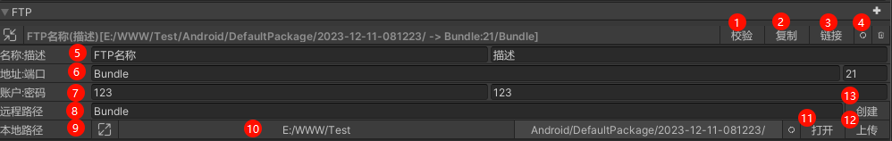

### Asset System 工具说明

> ### <a name="EditorTool.EditorMode.Init"> 编辑模式/初始化 </a>
> 

> 
> 

> [!NOTE]
>
> 1. 当前界面为编辑模式 第一次打开工具会自动创建一份 [ASConfig](./Config.md#aiouengineasconfig)
> 2. 当前工具可以在 Editor 无需安装第三方插件体验使用
> 3. 第一次使用顺序为 添加资源包 添加资源组 添加收集器(收集器的文件或者文件夹可以为空 但是在转化时会自动过滤)

> [!IMPORTANT]
> 
> 1. 如果使用 AssetSystem 初始化 则必须安装第三方插件
> 2. 如果使用 AssetSystem Remote 模式 则必须填写远端路径 否则会查找资源失败

>### <a name="EditorTool.EditorMode.Collect"> 编辑模式-收集器 </a>
> 

> 
> 

> [!NOTE]
> 1. 收集器面板开关
> 2. 收集器类型
>     - 动态资源 (默认) 需要代码明确调用加载的资源
>     - 静态资源 游戏中 默认加载的资源
>     - 依赖资源 动态资源的引用资源
> 3. 设置收集器文件夹或文件
> 4. 收集器删除 (删除收集器不会删除文件夹或文件)
> 5. 收集器查看 (查看收集器的文件夹或文件)
> 6. 寻址路径大小写规则
>     - 默认: 保持原始大小写
>     - 转小写: 转化为小写
>     - 转大写: 转化为大写
> 7. 寻址路径规则（支持自定义）
>     - Location = Group + Relative File Path
>     - More ...
> 8. 收集器包名规则（支持自定义）
>     - 默认: 文件路径
>     - More ...
> 9. 收集器状态
>     - 始终　 始终状态为忽略
>     - 编辑器 加载模式为编辑器模式下生效 (适配指定资源在 Editor 下存在使用)
>     - 运行时 加载模式为远端模式或者本地模式下生效 (适配指定资源在实机运行状态下存在使用)
> 10. 寻址路径是否需要后缀 (默认为 false)
> 11. 收集器 收集忽略规则 (支持自定义)
>     - 枚举选择 (默认)
>     - 自定义正则表达式
> 12. 收集器 收集忽略规则 是否启用自定义正则表达式
> 13. 收集器 自定义数据
>     - 用户自定义传入数据 (用于提供自定义规则使用)
> 14. 标签 (用于标记收集器)
>     - 支持多个标签(用; 分割)

> ### <a name="EditorTool.LookMode"> 查询模式 </a>
> 

> 
> 

> [!NOTE]
> 1. 包名选择 (默认为默认包) 只能单选
> 2. 资源组选择 (默认为默认组) 只能单选
> 3. 筛选 搜索框 (支持模糊搜索 匹配路径 文件名 包名 资源组名 类型)
> 4. 筛选 收集器列表 (支持多选 单选)
> 5. 筛选 资源类型 (支持多选 单选)
> 6. 筛选 资源标签 (支持多选 单选)
> 7. 分页 (默认为 1 页 一页 25 条数据) 可以跳转到最大页数 最小页数
> 8. 分页大小设置
> 9. 查询模式数据刷新
> 10. 切换模式
> 11. 资源寻址路径 (可以点击 效果为按照资源寻址路径排序)
> 12. 资源大小 (可以点击 效果为按照资源大小排序)
> 13. 资源修改时间 (可以点击 效果为按照资源修改时间排序)
> 14. 当前资源依赖资源列表
> 15. 打开目标资源文件夹 Unity Project 自动选中资源

> ### <a name="EditorTool.ConfigMode"> 配置模式 </a>
> 

> 
> 

> [!NOTE]
> 1. 资源系统 资源加载模式
>     - 编辑器模式 (编辑器 下默认)
>     - 远端模式 (实机运行 需要配置远端服务器地址)
>     - 本地模式 (实机运行 需要配置本地资源包路径)
> 2. 清空 Editor 下 远端模式下载的资源包
> 3. 清空 Bundles 缓存
> 4. 开启可寻址地址
> 5. 开启资源 GUID
> 6. 开启 Bundle 名称唯一
> 7. 开启资源系统日志输出
> 8. 开启资源寻址路径全部转小写
> 9. 运行时的内置文件夹
>     - BuiltinFiles (默认)
>     - 每个平台路径不一样 在实际使用时需要注意
> 10. 资源包配置 (会自动更新资源包配置)
> 11. 远端资源地址 (远端模式下生效) (实机运行时需要配置) (*远端模式必填)
> 12. 下载失败尝试次数 (远端模式下生效)
> 13. 资源同时加载的最大数量 (远端模式下生效) (WebGL 下无效)
> 14. 资源加载请求超时时间 (远端模式下生效)
> 15. 开启自动激活清单 (远端模式下生效)
> 16. 开启 URL 请求附加时间搓 (远端模式下生效)

> ### <a name="EditorTool.BuildMode.Config"> 打包工具 </a>
> 

> 
> 

> [!NOTE]
> 1. 是否为首包
> 2. 是否验证构建结构
> 3. 选择导出构建结构目录
> 4. 打开构建结构目录
> 5. 清空构建结构目录
> 6. 开始构建资源包
> 7. 构建资源包版本号
> 8. 构建资源包版本类型
> 9. 构建指定资源包
> 10. 构建管线
>     - 内置打包管线 (默认)
>     - 自定义打包管线 (需安装)
> 11. 资源包构建模式
>     - 强制重建模式 (默认) 不使用缓存 直接构建
>     - 增量构建模式 (需要使用缓存) 会根据缓存的资源进行增量构建 必须执行一次强制重建模式
>     - 演练构建模式 (需要使用缓存) 会根据缓存的资源进行增量构建 但是不会生成资源包
>     - 模拟构建模式 (编辑器模式下构建) 不会生成资源包
> 12. 首包标签集合 (用于标记首包资源) 自动组合为首包资源组

> ### <a name="EditorTool.BuildMode.FTP"> FTP 上传 </a>
> 

> 
> 

> [!NOTE]
> 1. 校验 FTP 配置是否能正常连接
> 2. 将构建导出目录复制到本地上传目录
> 3. 将构建导出目录符号链接到本地上传目录
> 4. 刷新本地上传目录
> 5. ftp 配置别名 描述
> 6. ftp 远端地址端口
> 7. ftp 远端地址账号密码
> 8. ftp 远端地址根目录
> 9. 本地上传目录 需要遵循 3 层目录结构 (平台/资源包/版本号)
> 10. 本地上传目录选择
> 11. 打开本地上传目录
> 12. 上传本地上传目录到远端 会更新当前上传根目录下 Version/平台.json 文件中的版本
> 13. 创建远端上传目录

>### <a name="EditorTool.BuildMode.FTP"> FTP 上传 </a>
> 

> 
> 

> [!NOTE]
> 1. 名称
> 2. 描述
> 3. 桶路径
> 4. 上传元数据设置
> 5. 上传本地文件夹路径
> 6. 打开本地文件夹路径
> 7. 上传本地文件夹到远端 同时会设置桶的元数据
