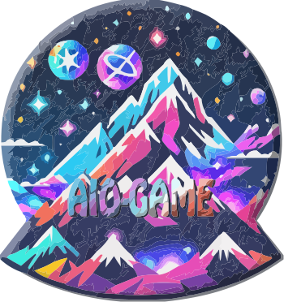

<p align="center">
    
</p>
<h1 align="center"> AIO Unity CLI Asset </h1>
<p align="center"> <a href="README_EN.md"> English </a> | 简体中文 </p>
<p align="center">
<a href="https://github.com/AIO-GAME/Unity.Asset.CLI/security/policy">  </a>
<a href="https://github.com/AIO-GAME/Unity.Asset.CLI">  </a>
<a href="https://github.com/AIO-GAME/Unity.Asset.CLI/blob/main/LICENSE.md">  </a>
<a href="https://img.shields.io/github/languages/code-size/AIO-GAME/Unity.Asset.CLI">  </a>
<a href="https://github.com/AIO-GAME/Unity.Asset.CLI/issues">  </a>
<a href="https://www.codetriage.com/aio-game/unity.asset.cli">  </a>
</p>
<p align="center">
<a href="https://github.com/AIO-GAME/Unity.Asset.CLI/tags">  </a>
<a href="https://openupm.com/packages/com.aio.cli.asset/">  </a>
</p>

## ⚙ Install

<details>
<summary>
<span style="color: deepskyblue; "> <b> Packages Manifest </b> </span>
</summary>

````json
{
  "dependencies": {
    "com.aio.cli.asset": "latest"
  },
  "scopedRegistries": [
    {
      "name": "package.openupm.com",
      "url": "https://package.openupm.com",
      "scopes": [
        "com.aio.cli.asset",
        "com.aio.package"
      ]
    }
  ]
}
````

</details>

<details>
<summary>
<span style="color: deepskyblue; "> <b> Unity PackageManager </b> </span>
</summary>

openupm 中国版

~~~
Name: package.openupm.cn
URL: https://package.openupm.cn
Scope(s): com.aio.cli.asset
~~~

openupm 国际版

~~~
Name: package.openupm.com
URL: https://package.openupm.com
Scope(s): com.aio.cli.asset
~~~

</details>

<details>
<summary>
<span style="color: deepskyblue; "> <b> Command Line </b> </span>
</summary>

openupm-cli

~~~
openupm add com.aio.cli.asset
~~~

</details>

## ⭐ About

- 这是Unity的资源加载接口(CLI)包。它提供了一组命令和工具来增强效率和开发体验。
- [x] 支持 Unity 2019.1 及以上版本
- [x] 支持 资源 同步加载/异步加载/协程加载 接口
- [x] 支持 资源 本地加载/远程加载 接口
- [x] 支持 Android/iOS/Windows/Mac/WebGL
- [x] 支持 YooAsset
- [x] 支持 Hybrid CLR
- [x] 支持 UniTask
- [x] 支持 .NET 4.0 or later

## 📖 Documentation

>| Doc                                                                | Description                                                                      |
>| :----------------------------------------------------------------- | :------------------------------------------------------------------------------- |
> |[Wiki](https://github.com/AIO-GAME/Unity.Asset.CLI/wiki)| 文档目录|
> |[API](./API_USAGE/AssetSystem.md)| API调用说明|
> |[Config](./API_USAGE/Config.md)| 配置讲解|
> |[Tool](./API_USAGE/ToolWindow.md)| 工具文档|

## 🔗 Third-Party References & Tools

> Please refer to the wiki for a list of references and tools used in this package.
> | Doc                                                                | Description                                                                      |
> | :----------------------------------------------------------------- | :------------------------------------------------------------------------------- |
> | [UniTask](https://github.com/Cysharp/UniTask#readme)               | 为 Unity 提供了一个有效的分配自由的 async / await 集成。                         |
> | [YooAsset](https://www.yooasset.com)                               | YooAsset 是一套用于 Unity3D 的资源管理系统，用于帮助研发团队快速部署和交付游戏。 |
> | [Hybrid CLR](https://focus-creative-games.github.io/hybridclr-doc) | 特性完整、零成本、高性能、低内存的 Unity 全平台原生 c#热更方案                   |


## 📢 Thanks

- 谢谢您选择我们的扩展包。
- 如果此软件包对您有所帮助。
- 请考虑通过添加⭐来表示支持。
