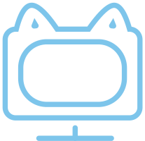

<p align="center">
    
</p>
<h1 align="center"> AIO Unity CLI Asset </h1>
<p align="center"> <a href="README.md"> 简体中文 </a> | English </p>
<p align="center">
<a href="https://github.com/AIO-GAME/Unity.Asset.CLI/security/policy">  </a>
<a href="https://github.com/AIO-GAME/Unity.Asset.CLI">  </a>
<a href="https://github.com/AIO-GAME/Unity.Asset.CLI/blob/main/LICENSE.md">  </a>
<a href="https://img.shields.io/github/languages/code-size/AIO-GAME/Unity.Asset.CLI">  </a>
<a href="https://github.com/AIO-GAME/Unity.Asset.CLI/issues">  </a>
<a href="https://www.codetriage.com/aio-game/unity.asset.cli">  </a>
</p>
<p align="center">
<a href="https://github.com/AIO-GAME/Unity.Asset.CLI/tags">  </a>
<a href="https://openupm.com/packages/com.aio.cli.asset/">  </a>
</p>

## ⚙ Install

<details>
<summary>
<span style="color: deepskyblue; "> <b> Packages Manifest </b> </span>
</summary>

````json
{
  "dependencies": {
    "com.aio.cli.asset": "latest"
  },
  "scopedRegistries": [
    {
      "name": "package.openupm.com",
      "url": "https://package.openupm.com",
      "scopes": [
        "com.aio.cli.asset",
        "com.aio.package"
      ]
    }
  ]
}
````

</details>

<details>
<summary>
<span style="color: deepskyblue; "> <b> Unity PackageManager </b> </span>
</summary>

openupm 中国版

~~~
Name: package.openupm.cn
URL: https://package.openupm.cn
Scope(s): com.aio.cli.asset
~~~

openupm 国际版

~~~
Name: package.openupm.com
URL: https://package.openupm.com
Scope(s): com.aio.cli.asset
~~~

</details>

<details>
<summary>
<span style="color: deepskyblue; "> <b> Command Line </b> </span>
</summary>

openupm-cli

~~~
openupm add com.aio.cli.asset
~~~

</details>

## ⭐ About

- **This is a Unity resource loading interface (CLI) package. It provides a set of commands and tools to enhance efficiency and development experience.**
> [!IMPORTANT]
> - ✅ **Supports Unity 2019.4 and above**
> - ✅ **Supports resource synchronous loading/asynchronous loading/coroutine loading interfaces**
> - ✅ **Supports resource local mode/remote mode/compiler mode interfaces**
> - ✅ **Supports empty package/first package/whole package/custom subpackages**
> - ✅ **Supports Android/iOS/Windows/Mac/WebGL**
> - ✅ **Supports CI/CD pipeline resource packaging**
> - ✅ **Supports .NET 4.x**
> - ✅ **Supports il2cpp**
> - ✅ **Supports Unity incremental build**
> - ✅ **Supports [UniTask](https://github.com/Cysharp/UniTask)**
> - ✅ **Supports [YooAsset](https://github.com/tuyoogame/YooAsset)**
> - ❌ **Does not support [XAsset](https://github.com/xasset/xasset)**
> - ❌ **Does not support [Addressable](https://github.com/Unity-Technologies/Addressables-Sample)**
> - ❌ **Does not support custom proxy third-party plugins**

## 📖 Documentation

- [_**Documentation Directory**_](https://github.com/AIO-GAME/Unity.Asset.CLI/wiki)
- [_**API**_](./API_USAGE/AssetSystem.md)
- [_**Configuration Explanation**_](./API_USAGE/Config.md)
- [_**Tool Usage**_](./API_USAGE/ToolWindow.md)

## 🔗 Third-Party References and Tools

**Please refer to the wiki for a list of references and tools used in this package.**
| **Doc** | **Description**                                                                      |
| :----: | :-----: |
| **[Common](https://github.com/AIO-GAME/Common)**| _**C# Unity common utility library to help development teams quickly build frameworks.**_ |
| **[UniTask](https://github.com/Cysharp/UniTask#readme)** | _**Provides an efficient allocation-free async/await integration for Unity.**_                         |
| **[YooAsset](https://www.yooasset.com)**| _**YooAsset is a resource management system for Unity3D designed to help development teams deploy and deliver games quickly.**_ |

## ✨ Contributors

<!-- readme: collaborators,contributors -start -->
<!-- readme: collaborators,contributors -end -->

## 📢 Acknowledgments

- **Thank you for choosing our extension package.**
- **If this package is helpful to you.**
- **Please consider showing support by adding a ⭐.**

