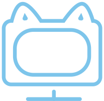

<p align="center">
    
</p>
<h1 align="center">AIO Unity CLI Asset</h1>
<p align="center"><a href="README_EN.md">English</a> | 简体中文</p>
<p align="center">
<a href="https://github.com/AIO-GAME/Unity.Asset.CLI/security/policy"></a>
<a href="https://github.com/AIO-GAME/Unity.Asset.CLI"></a>
<a href="https://github.com/AIO-GAME/Unity.Asset.CLI/blob/main/LICENSE.md"></a>
<a href="https://img.shields.io/github/languages/code-size/AIO-GAME/Unity.Asset.CLI"></a>
<a href="https://github.com/AIO-GAME/Unity.Asset.CLI/issues"></a>
<a href="https://www.codetriage.com/aio-game/unity.asset.cli"></a>
</p>
<p align="center">
<a href="https://github.com/AIO-GAME/Unity.Asset.CLI/tags"></a>
<a href="https://openupm.com/packages/com.aio.cli.asset/"></a>
</p>

## ⚙ Install

<details>
<summary>
<span style="color: deepskyblue; "><b>Packages Manifest</b></span>
</summary>

````json
{
  "dependencies": {
    "com.aio.cli.asset": "x.x.x"
  },
  "scopedRegistries": [
    {
      "name": "package.openupm.com",
      "url": "https://package.openupm.com",
      "scopes": [
        "com.aio.cli.asset",
        "com.aio.package"
      ]
    }
  ]
}
````

</details>

<details>
<summary>
<span style="color: deepskyblue; "><b>Unity PackageManager</b></span>
</summary>

openupm 中国版

~~~
Name: package.openupm.cn
URL: https://package.openupm.cn
Scope(s): com.aio.cli.asset
~~~

openupm 国际版

~~~
Name: package.openupm.com
URL: https://package.openupm.com
Scope(s): com.aio.cli.asset
~~~

</details>

<details>
<summary>
<span style="color: deepskyblue; "><b>Command Line</b></span>
</summary>

openupm-cli

~~~
openupm add com.aio.cli.asset
~~~

</details>

## 📢 Thanks

Thank you for choosing our package. If this package helps you, please consider showing your support by adding a ⭐ to the
repo.

## ⭐ About

This is a command line interface (CLI) package for Unity. It provides a set of commands and tools to enhance the
efficiency of Unity development.

## 🖥️ Requirements

- Unity 2019.1 or later
- .NET 6.0 or later

## 🧰 Getting Started

Please refer to the wiki for a step-by-step guide on how to get started with this package.

## 📖 Documentation

For more info please see | [Documentation](./Documentation~/CN/AssetSystem.md)
or [Wiki](https://github.com/AIO-GAME/Unity.Asset.CLI/wiki)

## 🤖 Demos

Please refer to the wiki for demo links.

## 🔗 Third-Party References & Tools

Please refer to the wiki for a list of references and tools used in this package.

| Doc                                                                | Description                                    |
|:-------------------------------------------------------------------|:-----------------------------------------------|
| [UniTask](https://github.com/Cysharp/UniTask#readme)               | 为Unity提供了一个有效的分配自由的 async / await 集成。          |
| [YooAsset](https://www.yooasset.com)                               | YooAsset是一套用于Unity3D的资源管理系统，用于帮助研发团队快速部署和交付游戏。 |
| [Hybrid CLR](https://focus-creative-games.github.io/hybridclr-doc) | 特性完整、零成本、高性能、低内存的Unity全平台原生c#热更方案              |

